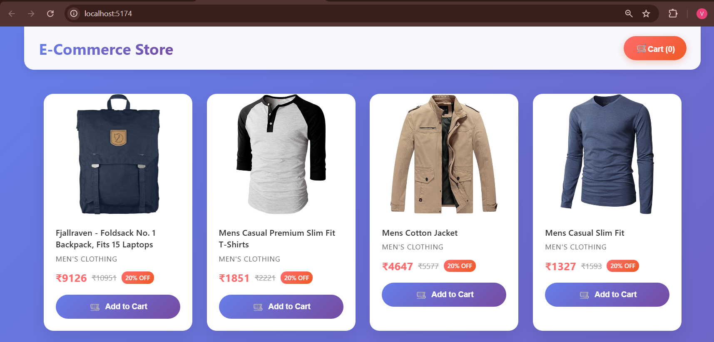
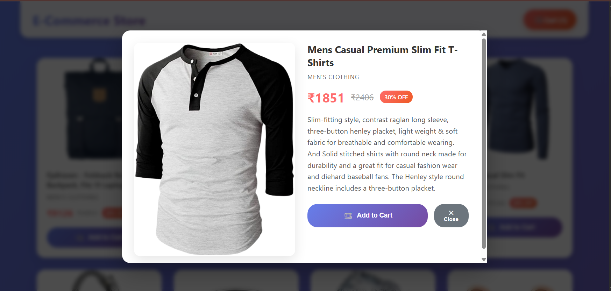
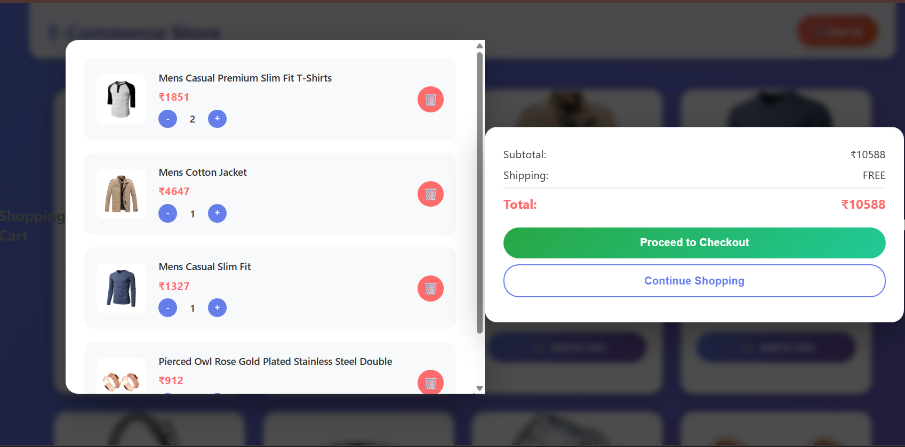
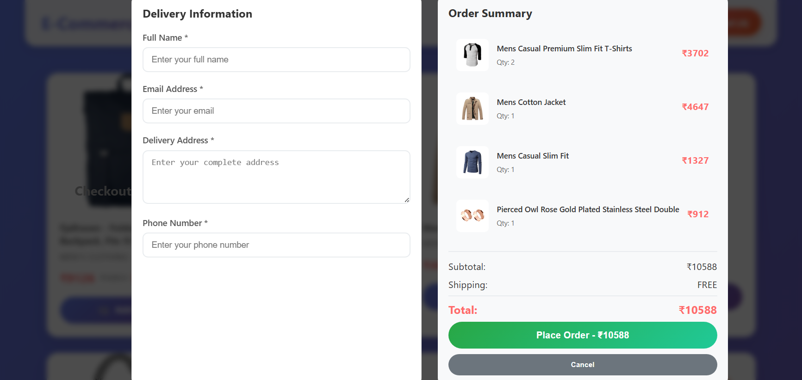
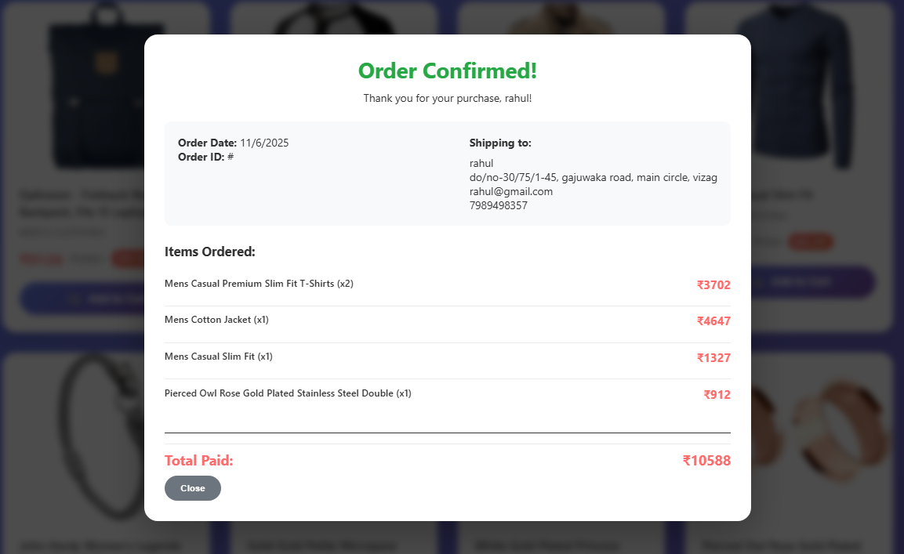

# E-Commerce Application

This is a full-stack e-commerce application with a React frontend and a Node.js backend.

### Backend APIs (Node/Express with SQLite DB):

- GET /api/products : Supported. Returns a list of mock products (fetched initially from Fake Store API and stored in DB) with id, name, price, and additional fields like description, category, and image. It provides more than 5-10 items for a realistic e-com feel.
- POST /api/cart : Supported. Adds an item to the cart with {productId, qty}, handling both new additions and quantity updates if the item exists.
- DELETE /api/cart/:id : Supported. Removes a specific item from the cart by ID.
- GET /api/cart : Supported. Retrieves the current cart items with details (including images) and calculates the total price.
- POST /api/checkout : Supported. Processes {cartItems} (though it uses customerInfo in the request), generates a mock receipt with total, timestamp, items, and customer details, then clears the cart.
The backend uses REST APIs, SQLite for persistence, and includes error handling (e.g., try-catch blocks and status codes).

### Frontend (React):

- Products grid with "Add to Cart" : Supported. Displays products in a responsive grid layout with images, prices (converted to INR), categories, and an "Add to Cart" button that triggers API calls and shows a toast notification.
- Cart view : Supported. Shows items with quantities, totals (including breakdowns for subtotal, shipping, and final total), remove buttons, and update quantity controls (+/- buttons).
- Checkout form : Supported. Includes fields for name, email, address, and phone; submits to the backend API and displays a receipt modal on success.
- Responsive design : Supported. The UI uses CSS media queries for mobile/tablet/desktop layouts, ensuring grids, modals, and forms adapt well (e.g., single-column on small screens).

### Bonus Features:

- DB persistence : Supported. Uses SQLite to store products and cart items persistently (with tables for products and cart_items).
- Error handling : Supported. Includes try-catch in API calls, error messages in UI, and a global error handler in Express.
- Fake Store API integration : Supported. Initially populates the products table from Fake Store API if empty.

### Additional Notes:

- The app is structured with /backend and /frontend folders, as required.
- No real payments are handled (mock checkout only).

## Setup Instructions

### Backend

1.  Navigate to the `backend` directory:
    ```bash
    cd backend
    ```
2.  Install the dependencies:
    ```bash
    npm install
    ```
3.  Start the backend server:
    ```bash
    npm start
    ```
    The server will run on port 5000.

### Frontend

1.  Navigate to the `frontend` directory:
    ```bash
    cd frontend
    ```
2.  Install the dependencies:
    ```bash
    npm install
    ```
3.  Start the frontend development server:
    ```bash
    npm run dev
    ```
    The application will be available at `http://localhost:5174`.

## Screenshots

### Product Grid


### Product View


### Cart View


### Checkout Form


### Receipt

